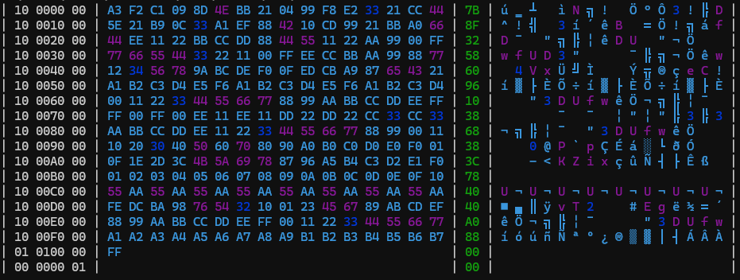

# chex
chex is a tool to quickly view .hex files in terminal

If you add the exe into your paths, you should be able to use it just like any other terminal command

## TODO:
- create help -h 
- create option to add start and end address to display only part of hex file
- polish coloring of characters
- check if checksum is correct
- print "metadata" of the hexfile
- add header to describe colums in the hexfile
